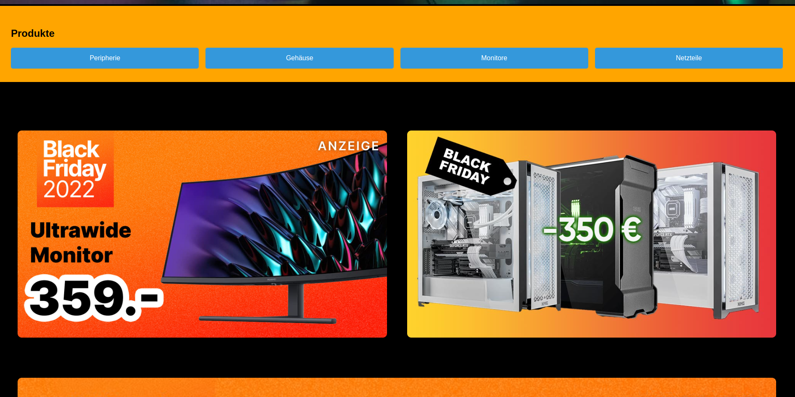

# Green Gaming: Environmentally Conscious and Sustainable Gaming

## Overview
This is a static frontend design for a website focused on environmentally conscious and sustainable gaming products. The website is built using HTML and CSS and is fully responsive across various screen sizes. The design includes pages for products, best offers, sustainable gaming, and a contact form.

## Features
- **Responsive Design**: Adapts to various screen sizes, including 600px, 890px, 1200px, and 1600px breakpoints.
- **Modern Layout**: Utilizes CSS Flexbox for layout and positioning.
- **Minimal Dependencies**: Uses Google Fonts for typography and simple CSS styles.
- **Static Pages**: Includes static HTML pages for different sections of the site with a template for easy expansion.

## Project Structure
- `index.html`: Main page with product overview and banner, product categories, blogs, articles (about sustinable gaming and environmental awarness) and contact informations.
- `css`: Directory for CSS files
- `README.md`: This README file

## Screenshots
Here are some screenshots of the project:

- 
- 
- 
- 

---

Thank you for taking the time to explore our Green Gaming project! For more information and updates, follow us on our social media or contact us directly.

